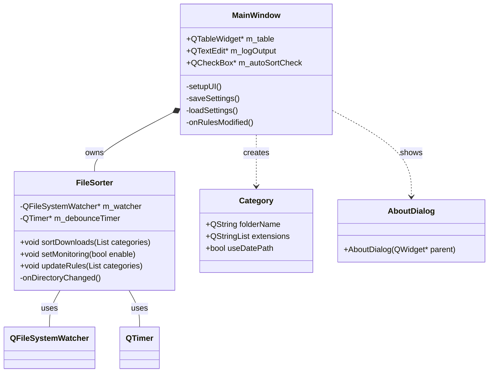
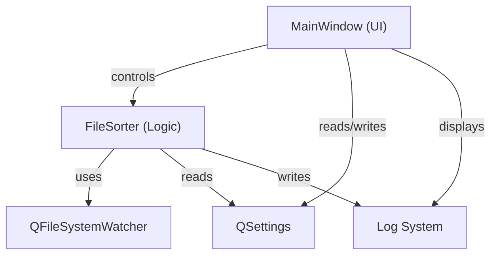
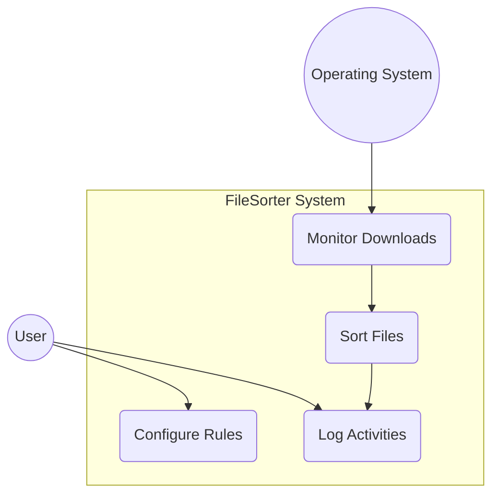
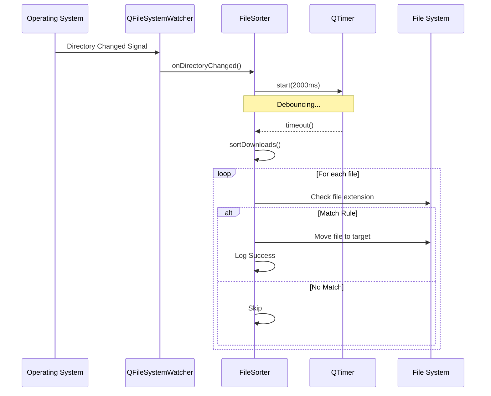
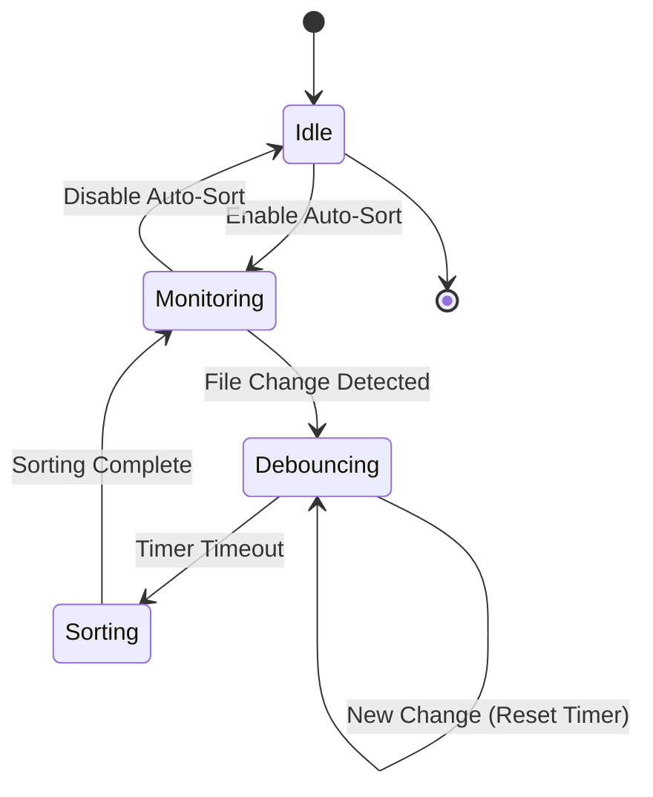
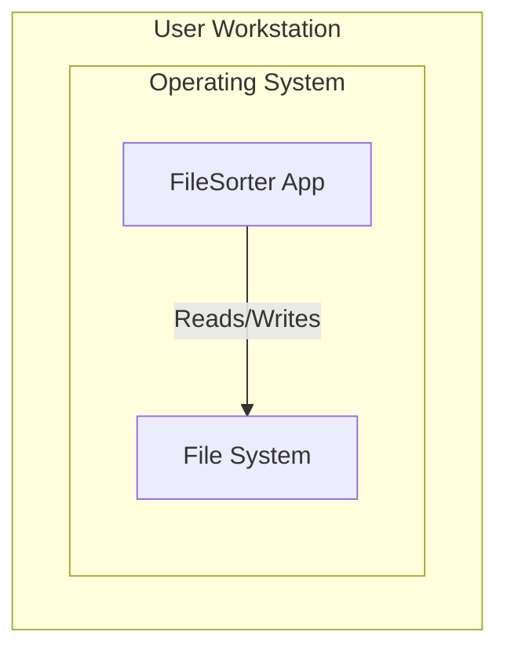
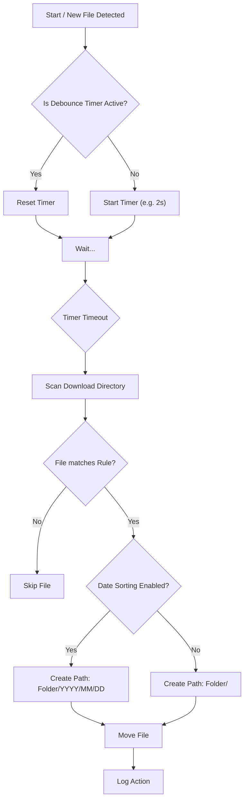

<div id="top" align="center">
<h1>FileSorter 📂</h1>
<p>cross-platform application to keep your Download folder organized</p>


[](https://github.com/Zheng-Bote/file-sorter/releases)
<br/>
[Report Issue](https://github.com/Zheng-Bote/file-sorter/issues) · [Request Feature](https://github.com/Zheng-Bote/file-sorter/pulls)

</div>

<hr>

<!-- START doctoc generated TOC please keep comment here to allow auto update -->
<!-- DON'T EDIT THIS SECTION, INSTEAD RE-RUN doctoc TO UPDATE -->
**Table of Contents**

- [Description](#description)
  - [✨ Key Features](#-key-features)
  - [Status](#status)
- [Documentation & Screenshots](#documentation--screenshots)
  - [Usage](#usage)
  - [⚙️ Configuration](#-configuration)
    - [Command Line Options](#command-line-options)
  - [Screenshots](#screenshots)
    - [Autostart Win11](#autostart-win11)
- [🚀 Getting Started](#-getting-started)
  - [Windows](#windows)
    - [Setup](#setup)
  - [Linux](#linux)
  - [Build](#build)
    - [Build Instructions](#build-instructions)
    - [Project Structure](#project-structure)
  - [🏗️ Architecture](#-architecture)
    - [Component Overview](#component-overview)
    - [Class Diagram](#class-diagram)
    - [Component Diagram](#component-diagram)
    - [Use Case Diagram](#use-case-diagram)
    - [Sequence Diagram](#sequence-diagram)
    - [State Machine Diagram](#state-machine-diagram)
    - [Deployment Diagram](#deployment-diagram)
    - [Sorting Flow Logic](#sorting-flow-logic)
- [🤝 Contributing](#-contributing)
- [📄 License](#-license)
- [👤 Author](#-author)
  - [Code Contributors](#code-contributors)

<!-- END doctoc generated TOC please keep comment here to allow auto update -->

<hr>

# Description


**FileSorter** is a robust, cross-platform desktop application designed to keep your Download folder organized. Built with modern **C++23** and **Qt6**, it automatically detects new files and sorts them into subdirectories based on user-defined rules.

## ✨ Key Features

- **Real-time Monitoring:** Uses `QFileSystemWatcher` to detect new files immediately.
- **Smart Debouncing:** Waits for downloads to finish (via `QTimer`) before moving files to avoid corruption.
- **Flexible Rules:** Map specific file extensions (e.g., `pdf, docx`) to custom folders.
- **Date-based Sorting:** Optional setting per rule to organize files into `YYYY/MM/DD` substructures.
- **Hot-Reloading Rules:** Changes to the configuration are applied immediately, even while monitoring is active.
- **Background Mode:** Start the application minimized via CLI (ideal for system autostart).
- **Cross-Platform:** Runs seamlessly on Windows, macOS, and Linux.
- **Internationalization (i18n):** Automatically switches between **English** and **German** based on system settings.
- **Persistent Configuration:** Rules are saved automatically using `QSettings` (Registry/Ini/Plist).

## Status


[](https://github.com/Zheng-Bote/file-sorter/releases)


---

# Documentation & Screenshots

## Usage

## ⚙️ Configuration

1. Launch the application.
2. Click "+" to add a new rule.
3. Folder Name: Enter the target subfolder name (e.g., Images).
4. Extensions: Comma-separated list (e.g., jpg, png, svg).
5. Use Date?: Check this box to organize files by year/month/day within the target folder.
6. Enable "Automatic Monitoring" to let the app work in the background.

To remove a rule, select the row and click "-".

> \[!NOTE]
> You can modify rules while "Automatic Monitoring" is active. The changes will be applied immediately.

### Command Line Options

You can start the application via the command line (or a shortcut) to launch it directly in the background with monitoring enabled.

| Option              | Description                                                                                      |
| :------------------ | :----------------------------------------------------------------------------------------------- |
| `-m`, `--minimized` | Starts the application minimized in the taskbar and automatically enables the folder monitoring. |

**Example:**

```bash
FileSorter.exe --minimized
```

## Screenshots


### Autostart Win11


---

([back to top](#top))

# 🚀 Getting Started

## Windows

### Setup

There are two options:

1. Unzip

   -> no Administrator rights needed

- unzip `FileSorter-1.2.1-win64.zip` and execute `FilesSorter.exe`

2. Setup

   -> no Administrator rights needed (optional)

- execute `FileSorter_x86_amd64_v1.2.1_setup.exe` and follow the instructions.
- doubleclick `FileSorter.exe` or your Desktop-Shortcut

## Linux

Just download the AppImage and make it executable:

```Bash
chmod +x FileSorter-1.2.1-x86_64.AppImage
sudo cp FileSorter-1.2.1-x86_64.AppImage /usr/local/bin/
```

And copy the desktop file to your desktop (Path depends on your Linux distribution):

```Bash
sudo cp resources/FileSorter.desktop ~/.local/share/applications/
```

And add it to your autostart (Path depends on your Linux distribution):

```Bash
sudo cp resources/FileSorter_autostart.desktop ~/.config/autostart/
```

And copy the app_icon (Path depends on your Linux distribution):

```Bash
sudo cp resources/app_icon.png /usr/local/share/icons/hicolor/256x256/apps/FileSorter.png
```

## Build

**_Prerequisites_**

- C++ Compiler supporting C++23 (GCC 13+, Clang 16+, MSVC 2022 v17.6+)
- CMake (3.23 or newer)
- Qt 6 (Core, Gui, Widgets, LinguistTools)

### Build Instructions

```Bash
# 1. Clone the repository
git clone [https://github.com/Zheng-Bote/file-sorter.git](https://github.com/Zheng-Bote/file-sorter.git)
cd file-sorter

# 2. Create build directory
mkdir build && cd build

# 3. Configure with CMake
cmake -DCMAKE_BUILD_TYPE=Release ..

# 4. Build
cmake --build . --config Release

# 5. Installer packages (optional, Windows only)
cpack.exe -C Release
# in some cases (if Chocolatey is installed on your system) the complete path to your Qt cpack is needed
& "C:\Qt\Tools\CMake_64\bin\cpack.exe" -C Release
```

### Project Structure

```Plaintext
file-sorter/
├── CMakeLists.txt       # Build configuration
├── resources.qrc        # Resource file (icons, etc.)
├── resources/           # Resource files (icons, logos, for AppImage etc.)
├── include/             # Header files (*.hpp)
├── src/                 # Source files (*.cpp)
├── translations/        # Translation files (*.ts)
└── configure/           # CMake configuration scripts
```

## 🏗️ Architecture

The application follows a clean separation of concerns, splitting the User Interface (UI) from the business logic.

### Component Overview

1.  **MainWindow (UI):** Handles user interaction, configuration (TableWidget), and displays logs. It manages the application lifecycle and processes optional CLI arguments (QCommandLineParser) to handle minimized starts.
2.  **FileSorter (Logic):** A `QObject` based worker class. It handles:
    - File system monitoring (`QFileSystemWatcher`).
    - Debouncing logic to wait for file write operations.
    - The actual sorting algorithm (Pattern matching & `std::filesystem`/`QDir` operations).
3.  **Config & Resources:**
    - `rz_config.hpp`: Generated by CMake for versioning and metadata.
    - `QSettings`: Stores sorting rules persistently.
    - `Qt Linguist`: Handles translations (`.ts` / `.qm`).

### Class Diagram



### Component Diagram



### Use Case Diagram



### Sequence Diagram



### State Machine Diagram



### Deployment Diagram



### Sorting Flow Logic

When Automatic Monitoring is enabled, the application follows this process:



---

([back to top](#top))

# 🤝 Contributing

Contributions are welcome! Please fork the repository and create a pull request.

1. Fork the Project
2. Create your Feature Branch (git checkout -b feature/AmazingFeature)
3. Commit your Changes (git commit -m 'Add some AmazingFeature')
4. Push to the Branch (git push origin feature/AmazingFeature)
5. Open a Pull Request

# 📄 License

Distributed under the MIT License. See LICENSE for more information.

Copyright (c) 2025 ZHENG Robert

# 👤 Author

[](https://www.github.com/Zheng-Bote)

## Code Contributors


<hr>
([back to top](#top))

:vulcan_salute:
