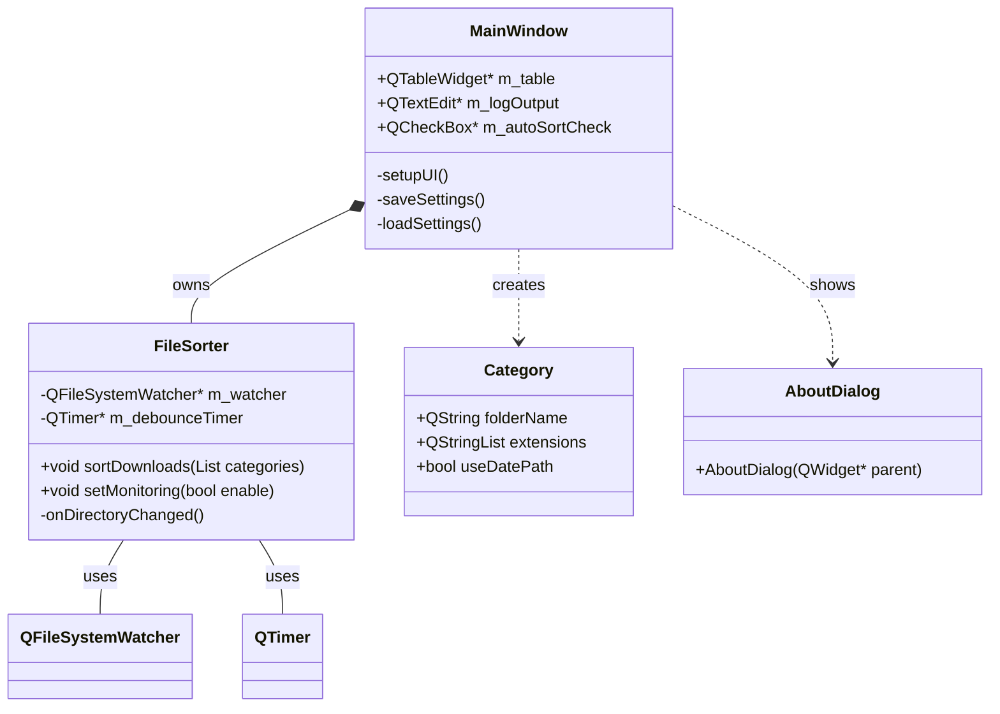
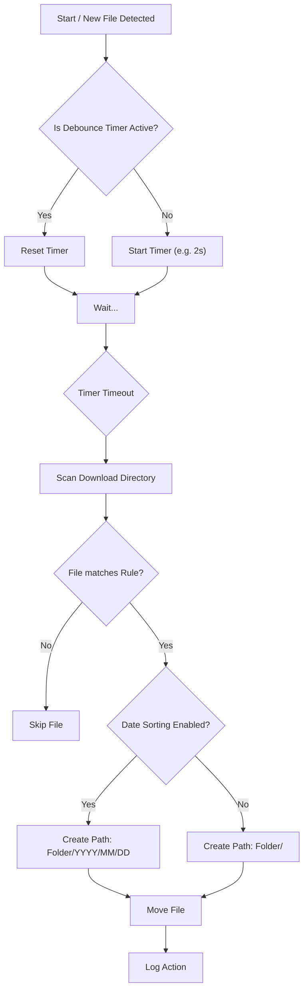

# FileSorter 📂


<p>keep your Downloads folder organized</p>

<hr>

<!-- START doctoc generated TOC please keep comment here to allow auto update -->
<!-- DON'T EDIT THIS SECTION, INSTEAD RE-RUN doctoc TO UPDATE -->
**Table of Contents**

- [FileSorter 📂](#filesorter-)
  - [✨ Key Features](#-key-features)
- [Documentation \& Screenshots](#documentation--screenshots)
  - [🏗️ Architecture](#️-architecture)
    - [Component Overview](#component-overview)
    - [Class Diagram](#class-diagram)
    - [Sorting Flow Logic](#sorting-flow-logic)
- [🚀 Getting Started](#-getting-started)
  - [Windows](#windows)
    - [Setup](#setup)
  - [Build Instructions](#build-instructions)
  - [Project Structure](#project-structure)
- [⚙️ Configuration](#️-configuration)
- [🤝 Contributing](#-contributing)
- [📄 License](#-license)
- [👤 Author](#-author)
  - [Code Contributors](#code-contributors)

<!-- END doctoc generated TOC please keep comment here to allow auto update -->

<hr>


**FileSorter** is a robust, cross-platform desktop application designed to keep your Downloads folder organized. Built with modern **C++23** and **Qt6**, it automatically detects new files and sorts them into subdirectories based on user-defined rules.

## ✨ Key Features

* **Real-time Monitoring:** Uses `QFileSystemWatcher` to detect new files immediately.
* **Smart Debouncing:** Waits for downloads to finish (via `QTimer`) before moving files to avoid corruption.
* **Flexible Rules:** Map specific file extensions (e.g., `pdf, docx`) to custom folders.
* **Date-based Sorting:** Optional setting per rule to organize files into `YYYY/MM/DD` substructures.
* **Cross-Platform:** Runs seamlessly on Windows, macOS, and Linux.
* **Internationalization (i18n):** Automatically switches between **English** and **German** based on system settings.
* **Persistent Configuration:** Rules are saved automatically using `QSettings` (Registry/Ini/Plist).

---

# Documentation & Screenshots


---
## 🏗️ Architecture

The application follows a clean separation of concerns, splitting the User Interface (UI) from the business logic.

### Component Overview

1.  **MainWindow (UI):** Handles user interaction, configuration (TableWidget), and displays logs. It manages the application lifecycle.
2.  **FileSorter (Logic):** A `QObject` based worker class. It handles:
    * File system monitoring (`QFileSystemWatcher`).
    * Debouncing logic to wait for file write operations.
    * The actual sorting algorithm (Pattern matching & `std::filesystem`/`QDir` operations).
3.  **Config & Resources:**
    * `rz_config.hpp`: Generated by CMake for versioning and metadata.
    * `QSettings`: Stores sorting rules persistently.
    * `Qt Linguist`: Handles translations (`.ts` / `.qm`).

### Class Diagram



### Sorting Flow Logic

When Automatic Monitoring is enabled, the application follows this process:



# 🚀 Getting Started

## Windows

### Setup 

There are two options:

1. Unzip

   -> no Administrator rights needed
- unzip `FileSorter-1.0.0-win64.zip` and execute `FilesSorter.exe`

2. Setup

   -> no Administrator rights needed (optional)
- execute `FileSorter_x86_amd64_v1.0.0_setup.exe` and follow the instructions.
- doubleclick `FileSorter.exe` or your Desktop-Shortcut
  

***Prerequisites***
- C++ Compiler supporting C++23 (GCC 13+, Clang 16+, MSVC 2022 v17.6+)
- CMake (3.23 or newer)
- Qt 6 (Core, Gui, Widgets, LinguistTools)

## Build Instructions

```Bash
# 1. Clone the repository
git clone [https://github.com/Zheng-Bote/file-sorter.git](https://github.com/Zheng-Bote/file-sorter.git)
cd file-sorter

# 2. Create build directory
mkdir build && cd build

# 3. Configure with CMake
cmake -DCMAKE_BUILD_TYPE=Release ..

# 4. Build
cmake --build . --config Release

# 5. Installer packages
cpack.exe -C Release
# in some cases (if Chocolatey is installed on your system) the complete path to your Qt cpack is needed
& "C:\Qt\Tools\CMake_64\bin\cpack.exe" -C Release
```

## Project Structure

```Plaintext
file-sorter/
├── CMakeLists.txt       # Build configuration
├── rz_config.hpp.in     # Template for versioning info
├── resources.qrc        # Resource file (icons, etc.)
├── include/             # Header files (*.hpp)
├── src/                 # Source files (*.cpp)
├── translations/        # Translation files (*.ts)
└── configure/           # CMake configuration scripts
```

# ⚙️ Configuration

1. Launch the application.
2. Click "+" to add a new rule.
3. Folder Name: Enter the target subfolder name (e.g., Images).
4. Extensions: Comma-separated list (e.g., jpg, png, svg).
5. Use Date?: Check this box to organize files by year/month/day within the target folder.
6. Enable "Automatic Monitoring" to let the app work in the background.

To remove a rule, select the row and click "-".

# 🤝 Contributing

Contributions are welcome! Please fork the repository and create a pull request.

1. Fork the Project
2. Create your Feature Branch (git checkout -b feature/AmazingFeature)
3. Commit your Changes (git commit -m 'Add some AmazingFeature')
4. Push to the Branch (git push origin feature/AmazingFeature)
5. Open a Pull Request

# 📄 License

Distributed under the MIT License. See LICENSE for more information.

# 👤 Author

[](https://www.github.com/Zheng-Bote)

## Code Contributors


[](https://www.github.com/Zheng-Bote)

([back to top](#top))

<hr>

:vulcan_salute:
