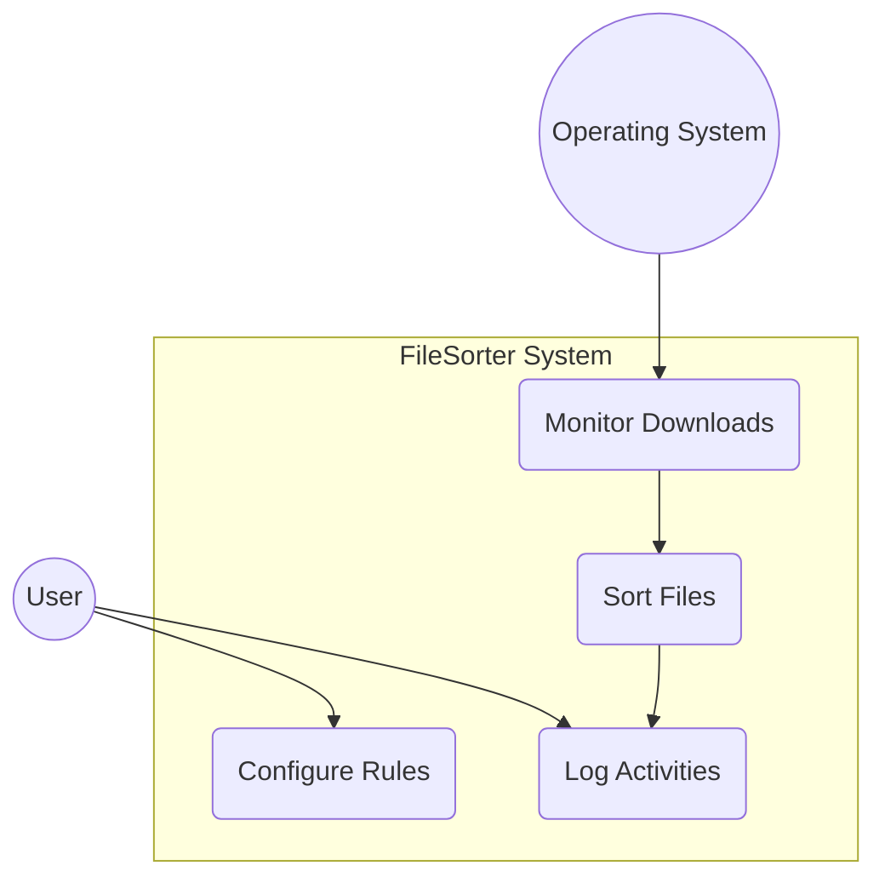
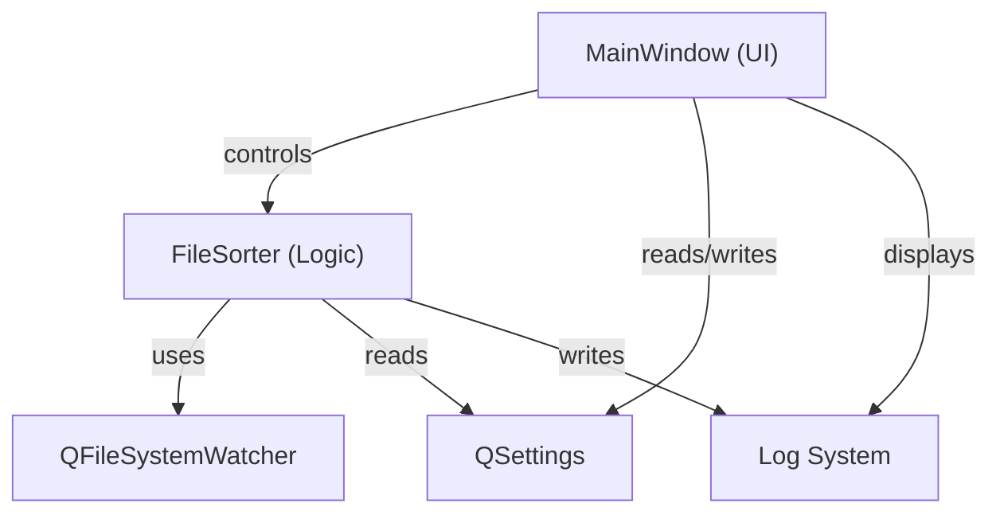
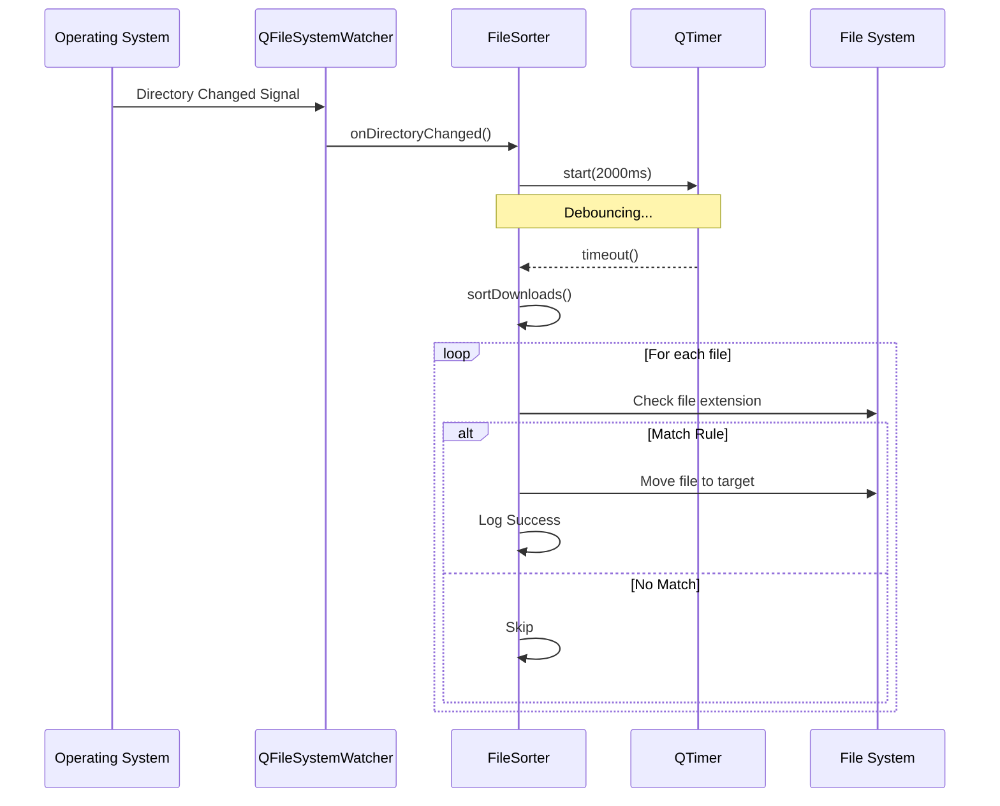
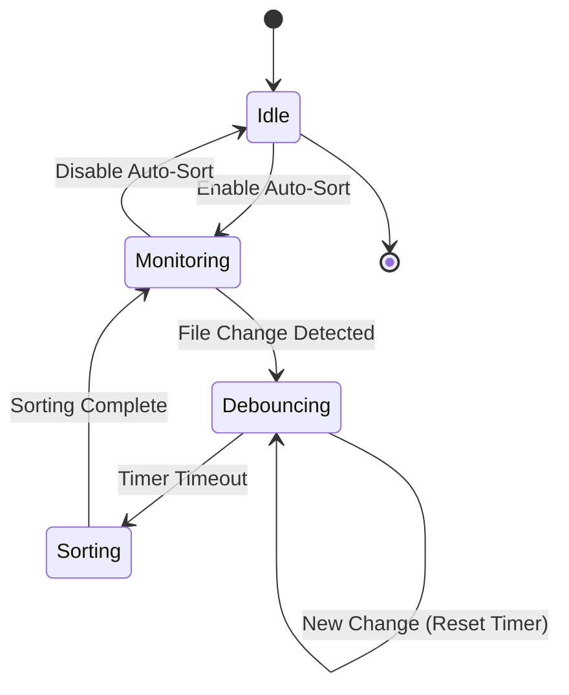
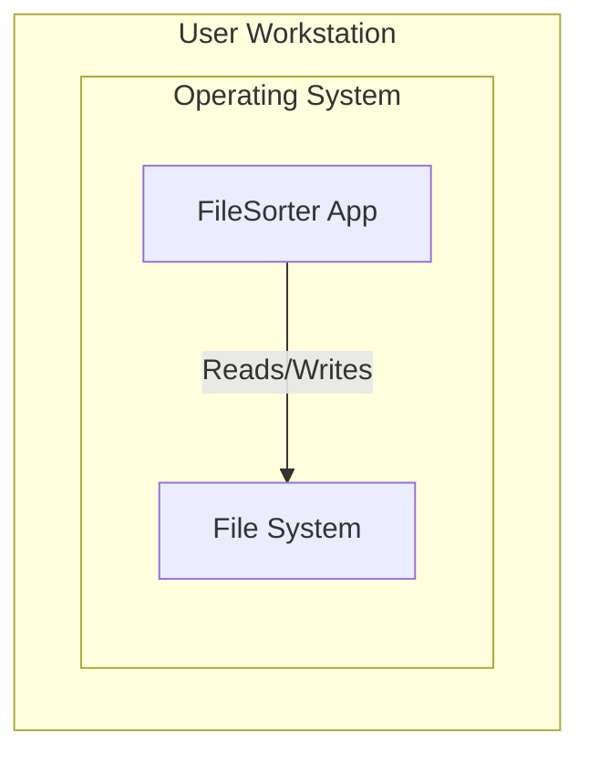

# Architecture Diagrams

This file contains the Mermaid source code for the architecture diagrams used in the project documentation.

## Use Case Diagram

## Component Diagram

## Sequence Diagram

## State Machine Diagram

## Deployment Diagram

