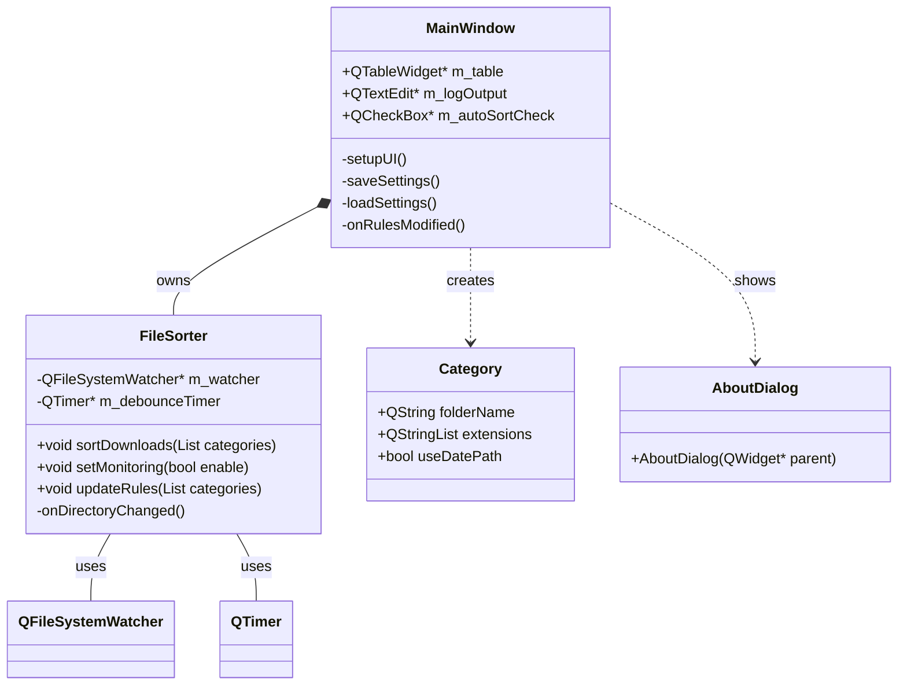
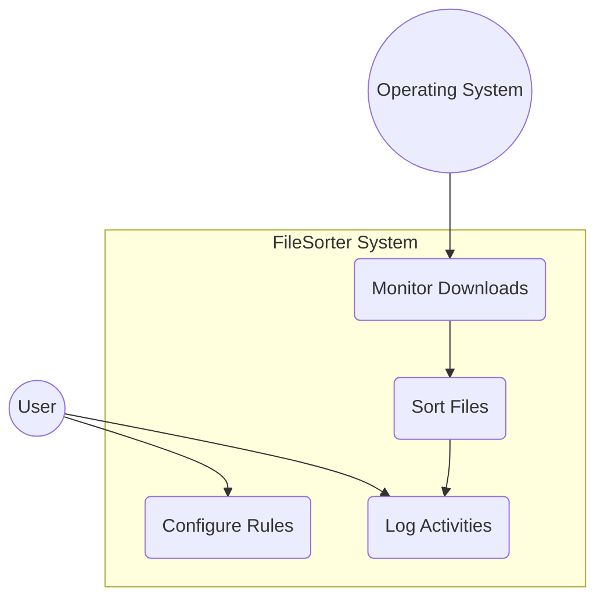
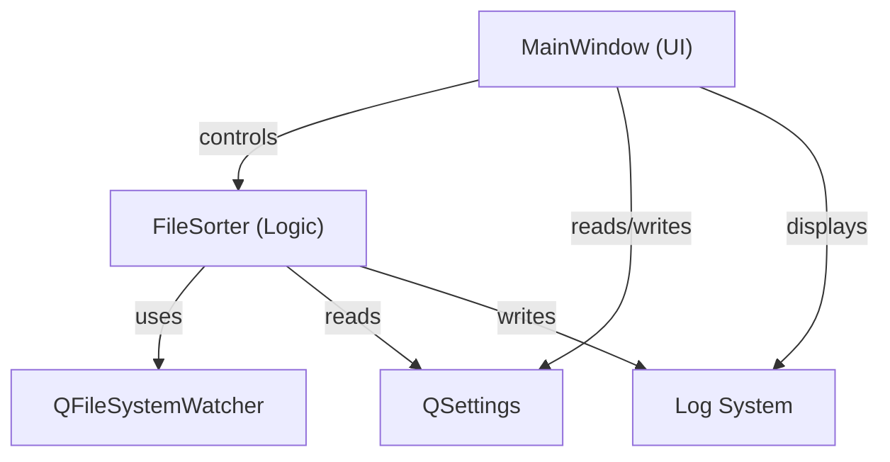
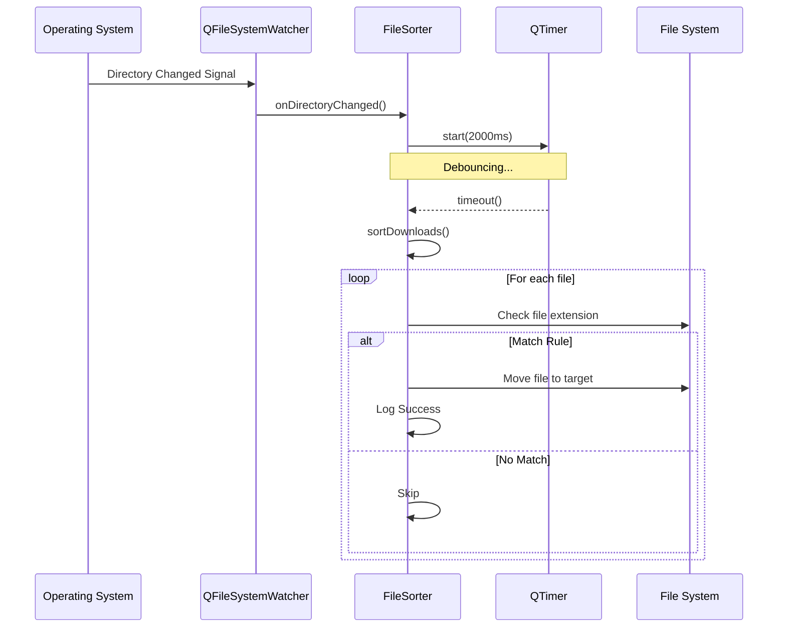
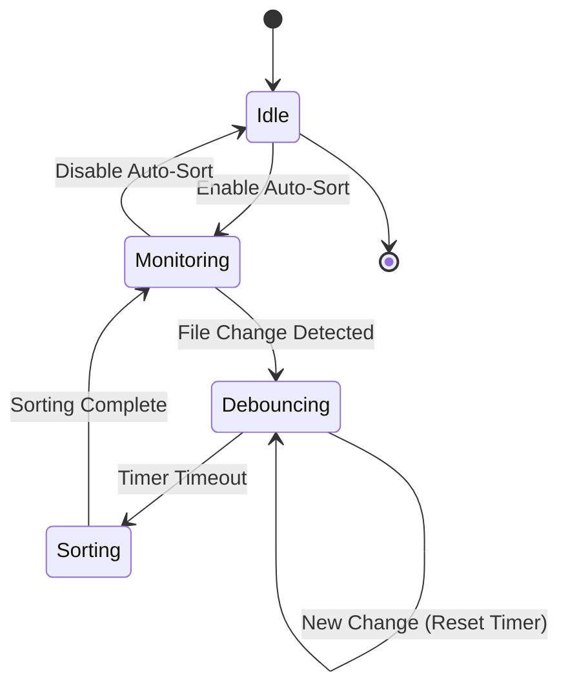
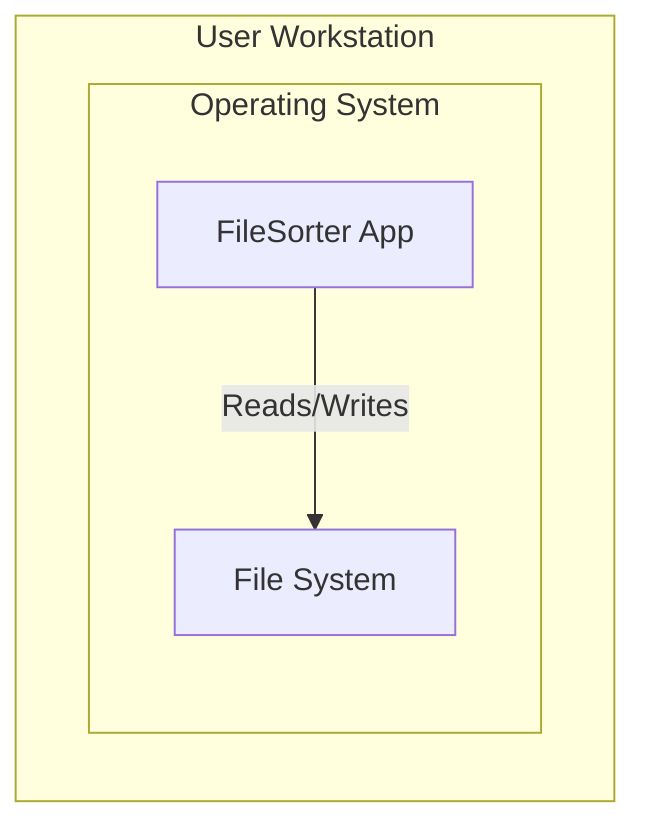
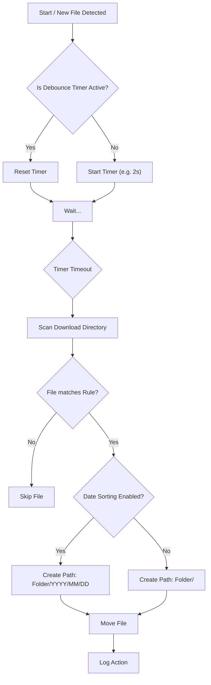

# Architecture Diagrams

This file contains the Mermaid source code for the architecture diagrams used in the project documentation.

---
<!-- START doctoc generated TOC please keep comment here to allow auto update -->
<!-- DON'T EDIT THIS SECTION, INSTEAD RE-RUN doctoc TO UPDATE -->
**Table of Contents**

- [Class Diagram](#class-diagram)
- [Use Case Diagram](#use-case-diagram)
- [Component Diagram](#component-diagram)
- [Sequence Diagram](#sequence-diagram)
- [State Machine Diagram](#state-machine-diagram)
- [Deployment Diagram](#deployment-diagram)
- [Sorting Flow Logic](#sorting-flow-logic)

<!-- END doctoc generated TOC please keep comment here to allow auto update -->

---

## Class Diagram

```mermaid
classDiagram
    class MainWindow {
        +QTableWidget* m_table
        +QTextEdit* m_logOutput
        +QCheckBox* m_autoSortCheck
        -setupUI()
        -saveSettings()
        -loadSettings()
        -onRulesModified()
    }

    class FileSorter {
        +void sortDownloads(List categories)
        +void setMonitoring(bool enable)
        +void updateRules(List categories)
        -QFileSystemWatcher* m_watcher
        -QTimer* m_debounceTimer
        -onDirectoryChanged()
    }

    class Category {
        +QString folderName
        +QStringList extensions
        +bool useDatePath
    }

    class AboutDialog {
        +AboutDialog(QWidget* parent)
    }

    MainWindow *-- FileSorter : owns
    MainWindow ..> Category : creates
    MainWindow ..> AboutDialog : shows
    FileSorter -- QFileSystemWatcher : uses
    FileSorter -- QTimer : uses
```

## Use Case Diagram

```mermaid
graph TD
    User((User))
    OS((Operating System))

    subgraph FileSorter [FileSorter System]
        UC1(Configure Rules)
        UC2(Monitor Downloads)
        UC3(Sort Files)
        UC4(Log Activities)
    end

    User --> UC1
    OS --> UC2
    UC2 --> UC3
    UC3 --> UC4
    User --> UC4
```

## Component Diagram

```mermaid
graph TD
    UI["MainWindow (UI)"]
    Logic["FileSorter (Logic)"]
    Config["QSettings"]
    Watcher["QFileSystemWatcher"]
    Logger["Log System"]

    UI -->|controls| Logic
    UI -->|reads/writes| Config
    UI -->|displays| Logger
    Logic -->|uses| Watcher
    Logic -->|reads| Config
    Logic -->|writes| Logger
```

## Sequence Diagram

```mermaid
sequenceDiagram
    participant OS as Operating System
    participant Watcher as QFileSystemWatcher
    participant Sorter as FileSorter
    participant Timer as QTimer
    participant FS as File System

    OS->>Watcher: Directory Changed Signal
    Watcher->>Sorter: onDirectoryChanged()
    Sorter->>Timer: start(2000ms)
    Note over Sorter, Timer: Debouncing...
    Timer-->>Sorter: timeout()
    Sorter->>Sorter: sortDownloads()
    Loop For each file
        Sorter->>FS: Check file extension
        Alt Match Rule
            Sorter->>FS: Move file to target
            Sorter->>Sorter: Log Success
        Else No Match
            Sorter->>Sorter: Skip
        End
    End
```

## State Machine Diagram

```mermaid
stateDiagram-v2
    [*] --> Idle
    Idle --> Monitoring : Enable Auto-Sort
    Monitoring --> Debouncing : File Change Detected
    Debouncing --> Debouncing : New Change (Reset Timer)
    Debouncing --> Sorting : Timer Timeout
    Sorting --> Monitoring : Sorting Complete
    Monitoring --> Idle : Disable Auto-Sort
    Idle --> [*]
```

## Deployment Diagram

```mermaid
graph TD
    subgraph Workstation [User Workstation]
        subgraph OS [Operating System]
            FS[File System]
            App[FileSorter App]
        end
    end
    App -->|Reads/Writes| FS
```

## Sorting Flow Logic

When Automatic Monitoring is enabled, the application follows this process:

```mermaid
flowchart TD
    A["Start / New File Detected"] --> B{"Is Debounce Timer Active?"}
    B -- Yes --> C["Reset Timer"]
    B -- No --> D["Start Timer (e.g. 2s)"]
    C --> E["Wait..."]
    D --> E
    E --> F{"Timer Timeout"}
    F --> G["Scan Download Directory"]
    G --> H{"File matches Rule?"}
    H -- No --> I["Skip File"]
    H -- Yes --> J{"Date Sorting Enabled?"}
    J -- Yes --> K["Create Path: Folder/YYYY/MM/DD"]
    J -- No --> L["Create Path: Folder/"]
    K --> M["Move File"]
    L --> M
    M --> N["Log Action"]
```
